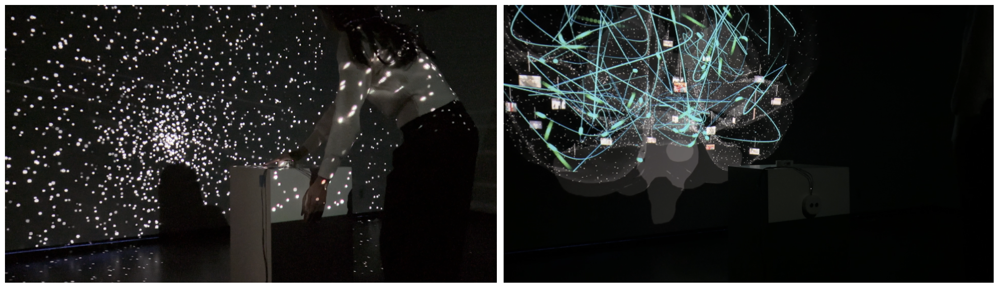
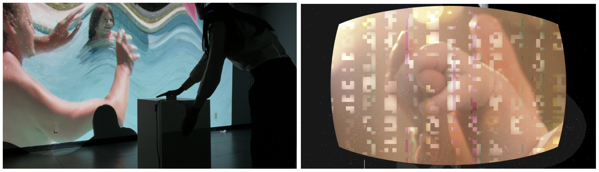
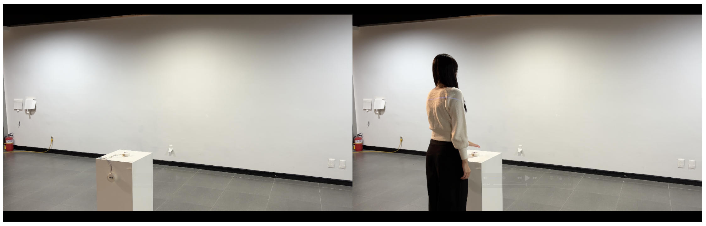

# HyperMemory 🧠

**HyperMemory** is a new media art project visualizing cognitive activities during the process of dying, implemented as a web-based spatial interaction using Three.js, GLSL, and Arduino.

### DEMO IS HERE 🎬

Please visit our [recorded demo](https://youtu.be/0h--CGvHH7A) first!

##  

### HyperMemory

Hypermemory is "**a scientific and rational exploration of the process of dying and its artistic expression.**" The project creates a liminal space where a human is neither alive nor dead—a moment of coactivity between the human and the non-(dead)-human.

This project is primarily based on recent research-(https://doi.org/10.1073/pnas.2216268120) indicating that the human brain becomes excessively active during the process of dying, suggesting that cognitive functions remain at work. This provides scientific support for the high likelihood of "life review," commonly referred to as "near-death experiences."

What might we see, feel, or think during this process? T o what extent can our consciousness intervene in this moment? This project seeks to answer these questions through its imaginative approach, offering an opportunity to reflect on the process of dying.

##  

### System

**Phase 1) Introduction**

The system starts with an empty space and a beating heart sound. When the user approaches both sensors, it transitions to the main phase with cardioplegia.

 

**Phase 2) Brain**

A hyperactive brain, neither alive nor dead, appears. Glitching neurons and memory fragments reflect its overstimulated state. Users can interact by moving closer to or farther from the sensors.

**Phase 3) Memory**

Approaching the sensors triggers a memory fragment video with a unique glitch effect. Seven videos represent keywords: Summer, Christmas, Preschool, High School, Freshman, Overseas Trip, and The First and Last Memory. The final video is always "The First and Last Memory."

 

**Phase 4) Ending**

After a set time, the brain disappears, returning to Phase 1. Is the brain alive or dead?

##  

### Interaction

The core interaction of Hypermemory is defined by the concept of "**approach**." It employs two ultrasonic distance sensors-(HC-SR04) to measure the distance between the system and the object in front of it. Regardless of the sensors' position in the space, they detect only objects within a pre-determined threshold. This flexibility allows the sensors to function effectively in various locations, as long as the thresholds are appropriately set.

 

The sensors symbolize **consciousness** and serve two key functions: When the user gets very close to both sensors, the system displays a distorted memory fragment. This interaction represents the idea that memories can be accessed when consciousness becomes more intense or focused.

Depending on the user’s position and the varying sensor values, the system alters the distortion and animation of the displayed memory. This behavior requires precise and sensitive control, reflecting the instability and fragility of consciousness in those moments.

##  

### Implementation

The main system is implemented on the web using Three.js. For better performance, most of the visual effects were written in GLSL code, 6 different shaders that run on the GPU for 3D scene rendering. The system receives sensor inputs through a serial connection via a physical wire.

Four ambient sounds created using Mubert-(a text-to-music AI service) were incorporated into the system. Seven memory videos were designed using source clips from Freepik-(a stock image and video platform).
